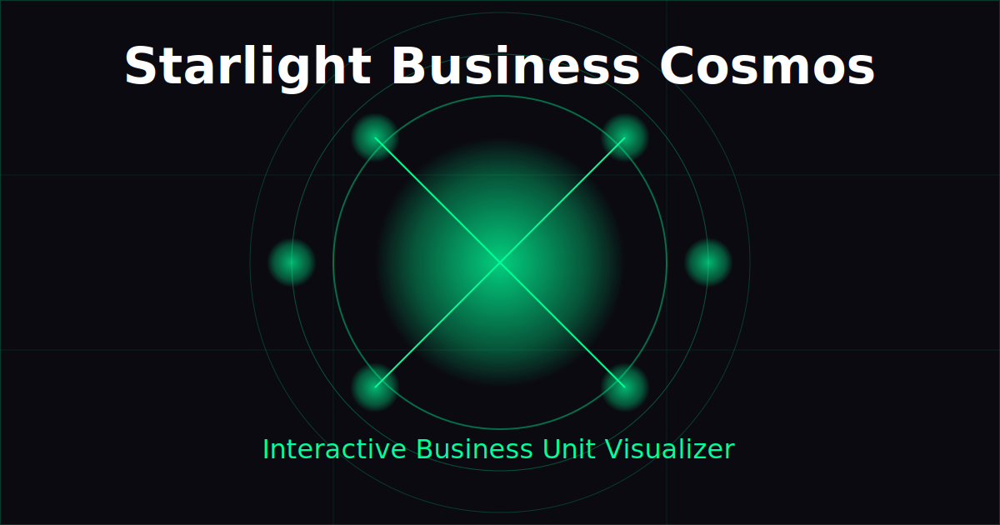

# Starlight Business Cosmos

An interactive business unit visualization tool with a futuristic cosmic theme. Enter your company name and see a beautiful orbital visualization of potential business units.



## Features

- Interactive 3D visualization of business units
- Cosmic-themed UI with futuristic design elements
- Responsive design for all device sizes
- Animated particles background with Three.js
- Tech-inspired UI components with glowing effects

## Technologies Used

This project is built with:

- Vite - Fast build tool and development server
- React - UI component library
- TypeScript - Type-safe JavaScript
- Tailwind CSS - Utility-first CSS framework
- shadcn/ui - Reusable UI components
- Three.js - 3D visualization library
- GSAP - Animation library

## Getting Started

### Prerequisites

- Node.js 18.x or higher
- npm or yarn

### Installation

```sh
# Clone the repository
git clone <YOUR_REPO_URL>

# Navigate to the project directory
cd starlight-business-cosmos

# Install dependencies
npm install

# Start the development server
npm run dev
```

## Deployment on Render.com

This project includes configuration for easy deployment on Render.com.

### Automatic Deployment

1. Create a new account or log in to [Render.com](https://render.com)
2. Click on "New" and select "Blueprint" from the dropdown
3. Connect your GitHub account and select this repository
4. Render will automatically detect the `render.yaml` configuration
5. Click "Apply" to deploy the application
6. Once deployed, you can access your application at the provided URL

### Manual Deployment

1. Create a new account or log in to [Render.com](https://render.com)
2. Click on "New" and select "Static Site" from the dropdown
3. Connect your GitHub account and select this repository
4. Configure the following settings:
   - **Name**: starlight-business-cosmos (or your preferred name)
   - **Build Command**: `npm install && npm run build`
   - **Publish Directory**: `dist`
5. Click "Create Static Site"
6. Once deployed, you can access your application at the provided URL

### Custom Domain

To connect a custom domain to your Render.com deployment:

1. Go to your dashboard on Render.com
2. Select your deployed application
3. Navigate to the "Settings" tab
4. Scroll down to the "Custom Domain" section
5. Click "Add Custom Domain" and follow the instructions

## Development

### Available Scripts

- `npm run dev` - Start the development server
- `npm run build` - Build the application for production
- `npm run preview` - Preview the production build locally

### Project Structure

- `src/` - Source code
  - `components/` - React components
  - `pages/` - Page components
  - `utils/` - Utility functions
  - `hooks/` - Custom React hooks
- `public/` - Static assets

## License

This project is licensed under the MIT License - see the LICENSE file for details.
